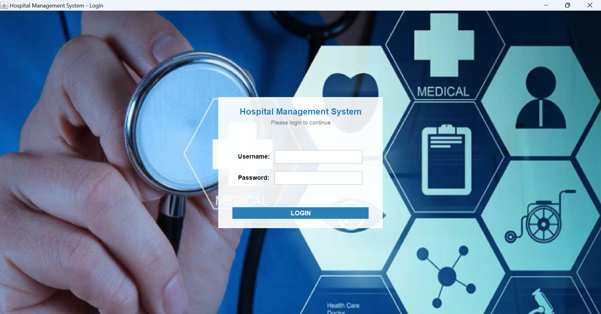

# Hospital Management System (Java + MySQL)

## 📘 Overview

The **Hospital Management System (HMS)** is a complete **Java-based desktop application** built using **Swing (GUI)** and **MySQL**.  
It provides an integrated solution for managing patients, doctors, appointments, billing, admissions, medical records, and other hospital operations — all through a clean and user-friendly interface.

This project is designed for real-time hospital data handling with a secure MySQL backend, professional GUI dashboards, and modular Java code architecture.

## Project Images:





## ⚙️ Features

### 👨‍⚕️ Patient Management
- Register new patients with complete personal and medical details  
- Maintain medical history (allergies, conditions, medications, surgeries, etc.)  
- Search, update, and manage active or discharged patients  

### 🧑‍⚕️ Doctor & Staff Management
- Add and manage doctors, nurses, and administrative staff  
- Assign specializations, shifts, and consultation timings  
- View departmental assignments and contact details  

### 🏥 Room & Admission Management
- Admit and discharge patients  
- Track room availability, occupancy, and charges  
- Automatically updates room status through triggers  

### 📅 Appointment Scheduling
- Book, reschedule, and cancel appointments  
- Prevent double-booking via database triggers  
- Maintain doctor-wise schedules and patient visit records  

### 💊 Prescription & Lab Module
- Record doctor prescriptions and test recommendations  
- Add prescribed medicines and dosage details  
- Manage lab tests and diagnostic reports  

### 💵 Billing & Payments
- Auto-generate bills with discounts and taxes  
- Manage partial and full payments  
- Real-time billing calculations using SQL triggers  

### 🚑 Ambulance Management
- Manage ambulance fleet and driver details  
- Track ambulance bookings, dispatch times, and trip charges  

### 🧾 Reports & Dashboard
- Generate and view real-time hospital reports  
- Patient summaries, financial overviews, and department statistics  
- Professionally styled GUI panels (consistent table design and visuals)  

### 🔐 Authentication & Roles
- Secure login for Admin, Doctor, Nurse, Accountant, and Receptionist  
- Role-based access to different modules  
- Audit logging for insert, update, delete, and login actions  

---

## 🗄️ Database Design (MySQL)

All database objects are defined in:

### ✅ Includes:
- 20+ tables  
- Views for quick reporting (e.g., `v_available_rooms`, `v_financial_summary`)  
- Stored Procedures for automation (e.g., `sp_admit_patient`, `sp_generate_bill`)  
- Triggers for data consistency and audit logging  
- Sample data for demo use  

---

## 🖥️ Technology Stack

| Component | Technology |
|------------|-------------|
| **Frontend (GUI)** | Java Swing |
| **Backend Logic** | Core Java (OOP, DAO Pattern) |
| **Database** | MySQL 8.0 |
| **IDE Used** | IntelliJ IDEA / NetBeans / Eclipse |
| **Database Connector** | MySQL Connector/J |
| **Build Tool** | Java SE (JDK 8 or higher) |

## 🧩 Dependencies

Your project requires the following external libraries (found in the `lib/` folder):

| Library | Purpose |
|----------|----------|
| **mysql-connector-j-9.5.0.jar** | Enables Java to connect and interact with the MySQL database |
| **jbcrypt-0.4.jar** | Provides password hashing for secure authentication (used for encrypting user passwords) |

### 🗂️ How to Add These Libraries

If you’re using an IDE like IntelliJ IDEA, NetBeans, or Eclipse:

1. Right-click your project → **Properties** or **Project Structure**
2. Go to **Libraries** → click **Add JARs or Directories**
3. Select both files from your `lib` folder:


## 📦 Project Structure


---

## ⚙️ Installation & Setup

### 1. Clone the Repository
```bash
git clone https://github.com/haifaafridi/EnhancedHospital-Management-System-Java-MySQL-.git


Setup the Database

Open MySQL Workbench or MySQL CLI

Run:

source database/hospital_schema.sql;

3. Configure Database Connection

In:

com/hospital/util/DBConnection.java


Update:

private static final String URL = "jdbc:mysql://localhost:3306/hospital_management_system";
private static final String USER = "root";
private static final String PASSWORD = "your_password";

4. Run the Application

Launch:

com.hospital.ui.MainDashboard


Login credentials:

Username: admin
Password: admin123

🧩 Modules
Module	Description
Patient Management	Register, update, and search patient records
Doctor Management	Manage doctor details and specializations
Appointments	Schedule and manage consultations
Billing System	Automated bill calculations and payment tracking
Admissions	Handle patient admission and discharge
Reports	Generate summaries and analytics
Authentication	Secure login system with roles
🧠 Key SQL Features Used

Foreign Keys for referential integrity

Triggers for automatic room and billing updates

Stored Procedures for admission, discharge, billing

Views for dashboard summaries

Indexes for optimized performance

🎨 GUI Highlights

Custom-designed Swing panels

Consistent theme across dashboards

Improved table headers (always visible)

Clean layout and easy navigation

👩‍💻 Developer

Developed by:
Haifa Afridi

📜 License

This project is open-source and available under the MIT License.


